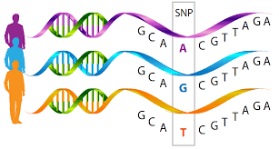

```{r setup, include=FALSE}
knitr::opts_chunk$set(echo = TRUE)
```


````{r warning=FALSE, message=FALSE}

library(SingleCellExperiment)
library(viridisLite)
library(ComplexHeatmap)
library(demuxSNP)
library(CiteFuse)
library(dittoSeq)
library(ggpubr)
library(Seurat)
library(gridExtra)
library(scater)

````

```{r}
colors <- structure(viridis(n = 3), names = c("-1", "0", "1"))
```

````{r}

source('../R/which_signal.R')
source('../R/draw_counts.R')
source('../R/plot_hashtag.R')

````

# Introduction to demultiplexing

## scRNASeq

scRNAseq allows further understanding of cell states, heterogeneity, in TME and other areas.
Sequencing costs are decreasing but remains a limiting factor in sample size.

For full analysis pipelines see 'link to OSCA'.

Multiplexing allows cells from multiple biological samples to be laoded simultaneously on the same lane 


## Demultiplexing


````{r fig.cap="Multiplexed (multi-sample) scRNAseq"}


````

Multiplexing is a technique introduced to reduce sequencing cost by increasing the number of cells loaded per lane, while also allowing identification of doublets.

````{r fig.cap="Multiplexed (multi-sample) scRNAseq"}

knitr::include_graphics("./images/multiplexing.png")

````

Multiplexing in scRNAseq involves the sequencing of samples from different
patients, treatment types or physiological locations together, resulting in
significant cost savings. The cells must then be demultiplexed, or assigned back
to their respective groups. A number of experimental and computational methods
have been proposed to facilitate this, but a universally robust algorithm
remains elusive. Below, we introduce the two main approaches for demultiplexing and illustrate them with simplified examples.


Successful demultiplexing is critical, with misassigned or unassigned cells resulting in increased waste and lower detectable fold changes between groups.

### Cell Hashing

Cells from each group are labelled with a distinct tag (HTO or LMO) which is
sequenced to give a counts matrix. 
Due to non-specific binding, these counts
form a bimodal distribution. 

````{r fig.cap="Cell hashing",fig.width=8}

knitr::include_graphics("./images/hashing.png")

````

Such methods are generally computationally
efficient. 
Their classification performance, however, is highly dependent on the
tagging quality and many methods do not account for uncertainty in
classification (@boggy_bff_2022, @kim_citefuse_2020 & @stoeckius_cell_2018).

More recent methods, including
[demuxmix](https://bioconductor.org/packages/release/bioc/html/demuxmix.html),
assign a probability that a cell is from a particular group, or made up of
multiple groups (doublet). This allows users to define a cut-off threshold for
the assignment confidence. Accounting for uncertainty is an important feature
for these types of algorithms. But, while they give the user greater flexibility
in determining which cells to keep, this ultimately results in a trade-off
between keeping cells which cannot be confidently called or discarding them -
due to issues with tagging quality rather than RNA quality.

Example matrix:

````{r}

data("CITEseq_example", package = "CiteFuse")
sce <- preprocessing(CITEseq_example)
altExp(sce,"HTO")<-as(altExp(sce,"HTO"),"SingleCellExperiment")
sce <- normaliseExprs(sce = sce, altExp_name = "HTO", transform = "log")
sce<-crossSampleDoublets(sce)
hto<-counts(altExp(sce,"HTO"))

hto[1:4,1:4]

````


#### Overall:

````{r out.width = '100%',fig.width=8}

Heatmap(log(as.matrix(hto)+1),cluster_rows=FALSE,show_column_names = FALSE)

````


#### Per cell:

Hashtag counts across cells

````{r out.width='100%',fig.width=8,fig.height=4}

df<-data.frame(hto)
df$group<-rownames(df)
ggplot(data=df, aes(x=group, y=AAGCCGCGTTGTCTTT)) +
  geom_bar(stat="identity")

````


#### Per hashtag

Hashtag counts across a Hashtag (bimodal distriution)

````{r out.width = '100%',fig.width=8}
set.seed(1)
bg<-rnbinom(n=500,size=5,mu=2)
sig<-rnbinom(n=400,size=10,mu=50)

df<-data.frame(t(logcounts(altExp(sce,"HTO"))))
myplots<-plot_hashtag(df)
do.call(grid.arrange,myplots)

````

Reduction in hashing quality leads to reduction in cell hashing algorithm performance.


````{r}

sce<-runPCA(sce, altexp="HTO", exprs_values = "logcounts")
dittoDimPlot(sce,reduction.use="PCA","doubletClassify_between_label")
sce<-runTSNE(sce, altexp = "HTO")
dittoDimPlot(sce,reduction.use="TSNE","doubletClassify_between_label")
````


### SNPs

The second class of methods exploits natural genetic variation between cells and
so can only be used where the groups are genetically distinct. 

````{r fig.cap="SNP variation between individuals",out.width='50%',fig.width=8}



````

#### Sample simulated SNPs

Below we describe  a simplified example of what SNP data may look like.

````{r out.width='100%',fig.width=8,fig.height=4}
set.seed(1)
n=c(50,50,50,50)
nsnps=20
snps_mat<-c()

for (i in seq_along(n)) {
  snp<-rbinom(nsnps,1,0.3)
  h<-matrix(rep(snp,n[i]),nsnps,n[i])
  colnames(h)<-rep(paste("Group",i),n[i])
  snps_mat<-cbind(snps_mat,h)
}
snps_mat[snps_mat==0]<-c(-1)
tot_mixed<-snps_mat[,sample(1:sum(n))]

h1<-Heatmap(snps_mat,
            cluster_columns=FALSE,
            cluster_rows=FALSE,
            col=colors,
            column_split=colnames(snps_mat),
            show_column_names = FALSE,
            name="SNP status", 
            row_title = "SNPs",
            column_title = "Cells",
            heatmap_legend_param = list(
            title = "SNP status", at = c(-1, 0, 1), 
            labels = c("Absent", "No reads", "Present")
    ))
draw(h1,column_title="Groupwise SNP profiles")
h2<-Heatmap(tot_mixed,
            cluster_columns = FALSE, 
            cluster_rows=FALSE, 
            col=colors, 
            show_column_names=FALSE, 
            name="SNP status", 
            row_title = "SNPs",
            column_title = "Cells",
            heatmap_legend_param = list(
            title = "SNP status", at = c(-1, 0, 1), 
            labels = c("Absent", "No reads", "Present")
    ))
draw(h2,column_title="Mixed SNP profiles")
h3<-Heatmap(tot_mixed,
            cluster_columns = TRUE,
            cluster_rows=FALSE,
            row_gap = unit(1, "mm"), 
            column_gap = unit(1, "mm"),
            column_split=4, 
            show_column_names=FALSE, 
            col=colors, name="SNP status", 
            row_title = "SNPs",
            column_title = "Cells",
            heatmap_legend_param = list(
            title = "SNP status", at = c(-1, 0, 1), 
            labels = c("Absent", "No reads", "Present")
    ))
draw(h3,column_title="Clustered SNP profiles")

````

Using this small example, we can reason how cells pooled from genetically distinct biological samples might be grouped.
In practice this task is made more complicated due to technical issues such as sequencing depth, ambient RNA, differing gene expression between cells, low quality cells, low sequencing coverage, doublets and low quality cells.

#### SNP profiles

````{r}

data(vartrix_consensus_snps,package='demuxSNP')
Heatmap(vartrix_consensus_snps,
        cluster_rows=FALSE,
        show_column_dend = FALSE,
        heatmap_legend_param = list(
        title = "SNP status", at = c(0, 1, 2, 3), 
        labels = c("No reads", "Ref", "Alt","Both")
    ))

````

Only some of these SNPs are present in the six samples, so lets filtered out some of the SNPs we don't have reads for across the board.

````{r}
filtered_mat<-vartrix_consensus_snps[rowSums(vartrix_consensus_snps>0)>1000,]
mode(filtered_mat)<-"integer"
Heatmap(filtered_mat,
        cluster_rows=FALSE,
        show_column_dend = FALSE,
        heatmap_legend_param = list(
        title = "SNP status", at = c(0, 1, 2, 3), 
        labels = c("No reads", "Ref", "Alt","Both")
    ))

filtered_mat[filtered_mat == 0] <- c(0)
filtered_mat[filtered_mat == 1] <- c(-1)
filtered_mat[filtered_mat == 2] <- 1
filtered_mat[filtered_mat == 3] <- 1

````

Finally, we simplify the data to present, absent, or no reads in relation to our six samples.

````{r}

Heatmap(filtered_mat,
        cluster_rows=FALSE,
        show_column_dend = FALSE,
        col = colors,
        heatmap_legend_param = list(
        title = "SNP status", at = c(-1, 0, 1), 
        labels = c("Absent","No reads", "Present")
    ))

````


## Sessioninfo

````{r}

sessionInfo()

````


## References
